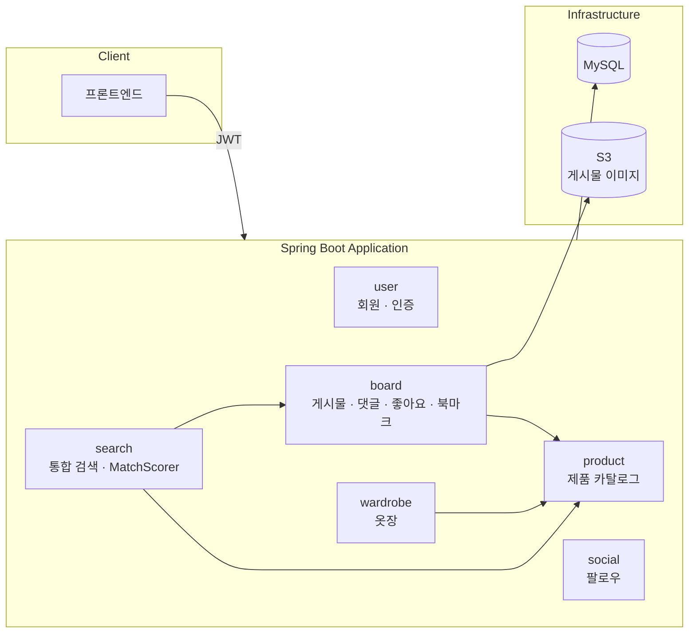

# LINDO — 코디 공유 플랫폼

코디 사진과 제품 정보를 함께 제공하는 플랫폼입니다. 사용자가 자신의 옷장을 등록하고 착장 사진에 제품을 태깅해 코디 게시물을 올리면, 다른 사용자가 게시물과 제품을 하나의 검색으로 함께 찾을 수 있습니다.

## 목차

- [주요 기능](#주요-기능)
- [기술 스택](#기술-스택)
- [아키텍처](#아키텍처)
- [실행 방법](#실행-방법)
- [초기 데이터](#초기-데이터)

## 주요 기능

**사용자**
- 회원가입 / 로그인 (JWT 기반 인증)
- 옷장(Wardrobe) 등록, 카테고리별 그룹 조회, 옷장 내 제품 검색
- 코디 게시물 작성 — 여러 장의 이미지 업로드 및 이미지 위 특정 좌표(x, y)에 제품 태깅
- 게시물 좋아요 / 북마크 / 댓글
- 팔로우 · 팔로워 목록 조회, 커서 기반 무한 스크롤 피드
- 게시물 + 제품 통합 검색 (필드별 가중치를 둔 커스텀 관련도 스코어링)

## 기술 스택

| 구분 | 스택 |
|---|---|
| Language / Runtime | Java 21 |
| Framework | Spring Boot 3.2 (Spring MVC, Spring Security) |
| Database | MySQL |
| Query | Spring Data JPA, QueryDSL |
| 인증 | JWT (jjwt) |
| 파일 스토리지 | AWS S3 |
| 인프라 / 배포 | Docker, AWS CodeBuild, AWS ECR, AWS ECS |
| 아키텍처 검증 | ArchUnit (패키지 간 의존 방향 테스트) |

## 아키텍처

`presentation`(controller · security config · 예외 처리) / `application`(board · product · search · social · user · wardrobe 도메인 서비스 · 엔티티) / `common`(유틸리티) 3개 레이어로 구성됩니다. 도메인 간 의존 방향은 ArchUnit 테스트로 강제합니다.



**배포**: AWS CodeBuild가 `buildspec-prod.yml` 기준으로 이미지를 빌드해 ECR에 푸시하고, 최신 태스크 정의로 교체해 ECS 서비스에 배포합니다.

## 실행 방법

### 사전 준비
- Java 21
- MySQL
- 이미지 업로드용 AWS S3 버킷 및 자격 증명

### 설정

`src/main/resources/example.yml`을 참고해 `application-local.yml`을 만들고 아래 값을 채워넣습니다.

```yaml
spring:
  datasource:
    url: jdbc:mysql://localhost:3306/lindo?useSSL=false&useUnicode=true&serverTimezone=Asia/Seoul
    username: <DB 계정>
    password: <DB 비밀번호>

jwt:
  secret: <JWT 서명용 시크릿>

cloud:
  aws:
    credentials:
      access-key: <AWS access key>
      secret-key: <AWS secret key>
    region:
      static: ap-northeast-2
    s3:
      bucket: <S3 버킷 이름>
```

### 로컬 구동

```bash
git clone <repo-url>
cd lindo-backend
./gradlew bootRun
```

기본 프로필은 `local`이며, MySQL과 위 설정 파일이 준비되어 있어야 정상 구동됩니다.

### 테스트 실행

```bash
./gradlew test
```

단위/통합 테스트와 함께, ArchUnit으로 레이어 간 의존 방향(예: `presentation` → `application` 단방향)이 지켜지는지도 검증합니다.

## 초기 데이터

별도로 시딩된 테스트 계정은 없으며, `POST /api/v1/app/users/signup`으로 회원가입 후 로그인해 이용합니다. 제품 카탈로그 초기 데이터는 `src/main/resources/db/initial_product_loader.py` 스크립트로 적재합니다.
